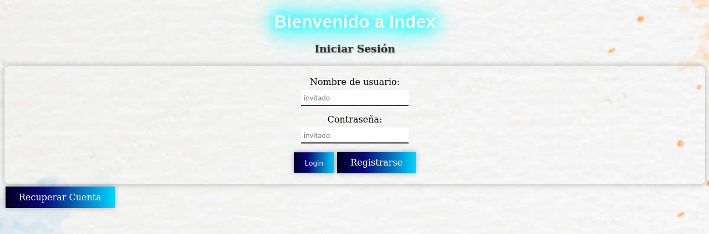
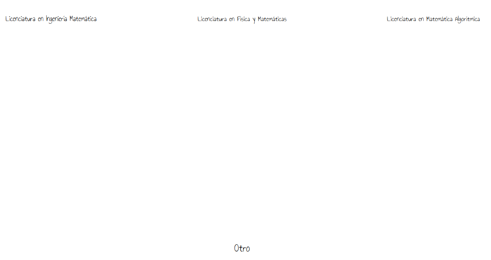
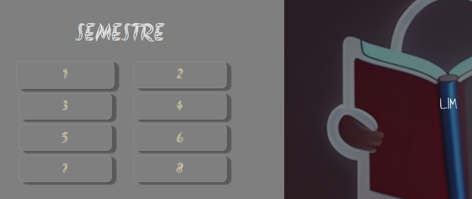
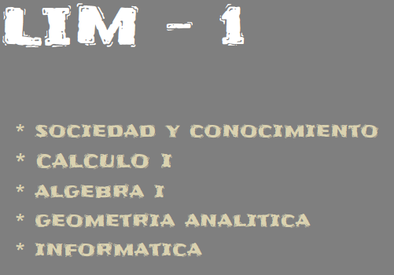
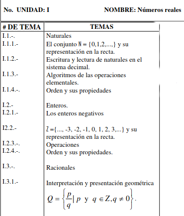
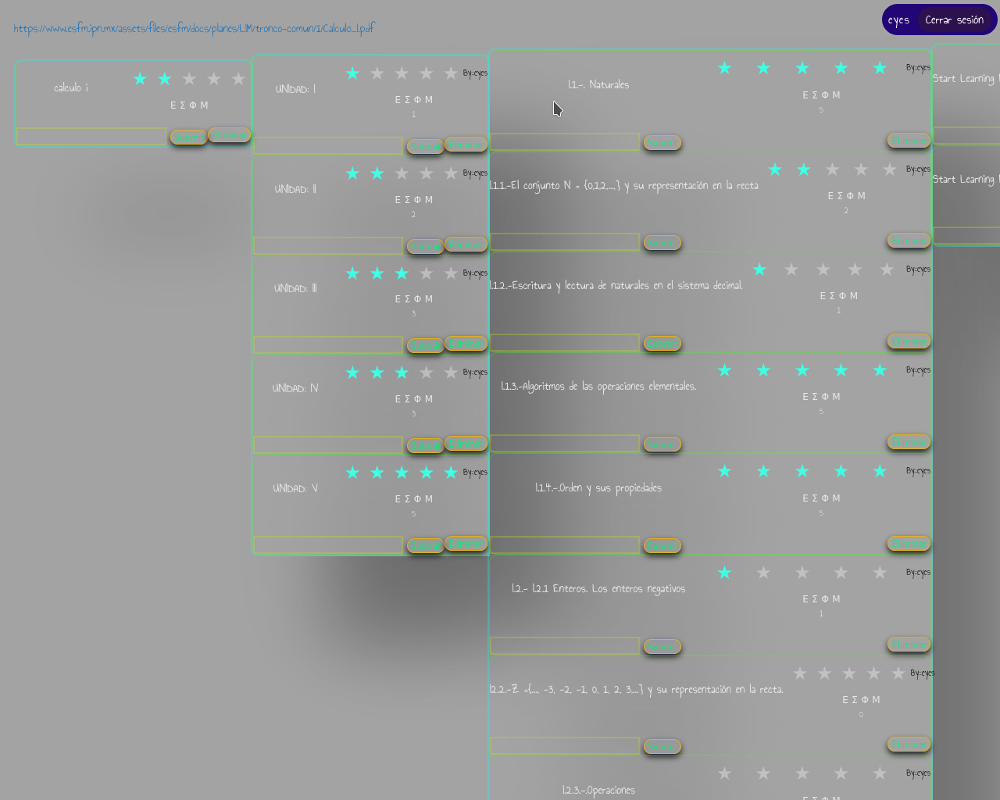
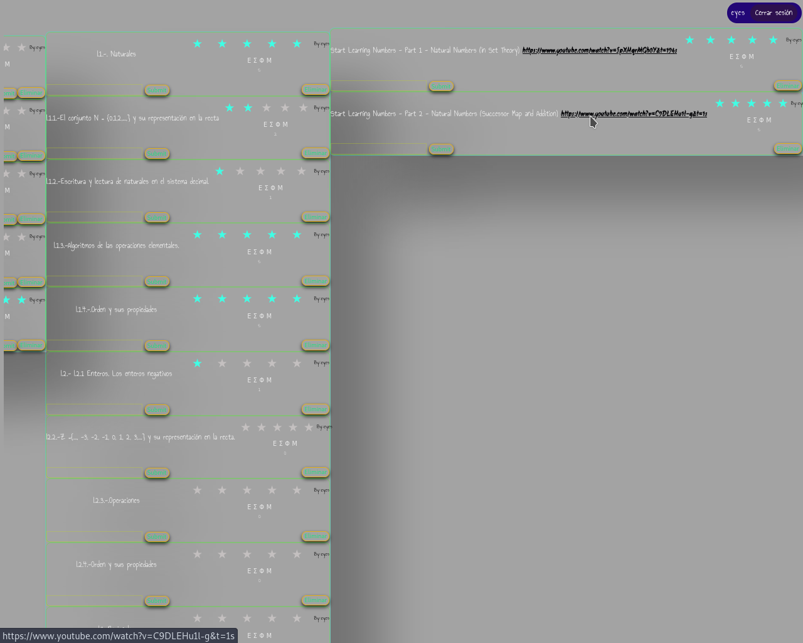
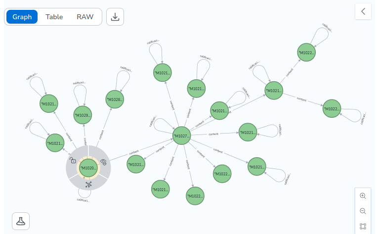

# ESFM_WEB_2
Se presenta un web sencilla para agregar temas basados en nodos usando neo4j, la idea principal es poder recopilar información
sobre temas que se consideren útiles y agregarlos, en general se necesitan algunas configuraciones indicadas en INFO
además de una instancia SQL con las siguientes columnas nick, email, password_hash.

Temario de Cálculo I

Se agregan a nodos por tema, viéndose de la siguiente forma:

Nodos de los temas creados

